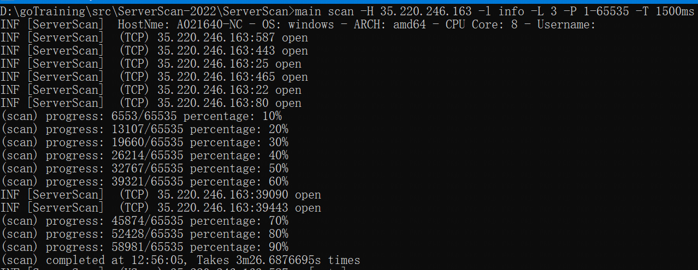
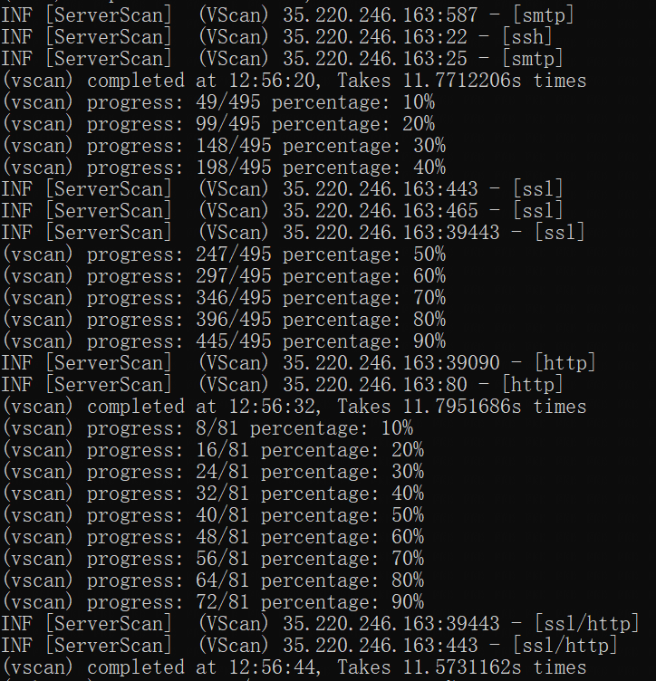
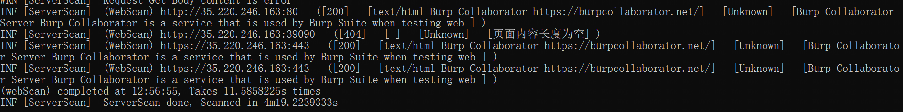

# concurrency
   

### 简介

- **项目是基于ants框架设计的高效网络并发请求**
- **高并发下CPU性能监控**
- **使用场景：端口扫描、服务指纹识别、Web请求**

---

### **设计思路**

在一台终端上使用Go原生的并发处理10万TCP连接，会出现有CPU和内存占用过高和TCP连接超时等问题。

- **内存占用过高：由于同时创建了10万个Goroutine，每个Goroutine占用了不少内存**

  解决方案：使用ants协程池，可以重复利用Goroutine，减少大规模的创建Goroutine

- **CPU占用过高：由于同时执行10万TCP连接，拿到响应数据后可能会做一些时间复杂度高的操作导致CPU占用过高**

  解决方案：使用gopsutil库提供的CPU数据接口，监控CPU的变动，然后根据CPU的占用率动态调整ants协程池的数量，就能有效降低CPU占用率

- **TCP连接超时：由于在并发网络扫描任务在结束后依旧会占用部分本地网络和系统资源，同时并发10万个TCP连接就会影响结果的准确性**

  解决方案：在单个并发任务执行时，使用某个区间的随机数作为休眠时间，可以使得每个任务是错峰执行的。然后根据总任务数量划分成若干个组，每个组任务执行完会进行休眠特定时间，然后再执行下一个组，这样处理就能减缓网络连接压力

---

### 安装

```
go get -u github.com/jxust-xiaoxiong/concurrency
```

---

### 使用

1. **初始化对象concurrency，有两种方法初始化**

   - 不带参数初始化，使用默认值

   ```go
   var c := concurrency.New()
   ```

   - 带参数初始化

   ```go
   var c := concurrency.NewConcurrency(concurrency.Concurrency{
   			TaskGroupCount:     1000,
   			TaskTimeSleep:      concurrency.Range{LValue: 0, RValue: 300},
   			TaskGroupTimeSleep: 1500,
   			GoroutineNumLimit:  5000,
   			GoroutineNum:       3000,
   			SysMonitor:         true,
   			TaskTimeOut:        7500,
   			LogLevel:           0,
   		})
   ```

2. **执行并发任务**

      - 并发任务参数以数组的方式传递

      ```go
      func (p *TcpProcessor) HostScan(hosts []string) []interface{} {
          var portScanParams []interface{}
          for _, host := range hosts {
              for _, port := range p.Ports {
                  portScanParams = append(
                      //初始化和构建扫描任务的参数
                      portScanParams, ScanParam{
                          Port:    port,
                          Host:    host,
                          Timeout: time.Duration(p.Timeout) * time.Millisecond,
                      },
                  )
              }
          }
      
          taskRet := c.Run(
              concurrency.TaskParam{
                  TaskParams: portScanParams, //执行扫描任务的参数
                  TaskFunc:   p.PortScan,     //带执行的并发任务
                  TaskName: 	constant.ScanModel,
              },
          )
          return taskRet
      }
      ```

      - 并发任务参数以函数回调的方式传递，该方法是为了满足初始化并发参数数组占用内存过大，导致程序无法运行的解决方案

      ```go
      type HostScanParams struct {
      	obj *TcpProcessor
      }
      
      func (h HostScanParams) ParamsCreate(ch chan interface{}, taskTotal chan int) {
      	p := h.obj
      
      	taskTotal <- len(p.Hosts) * len(p.Ports) //任务总数量
      
      	for _, host := range p.Hosts {
      		for _, port := range p.Ports {
      			ch <- ScanParam{
      				Port:    port,
      				Host:    host,
      				Timeout: time.Duration(p.Timeout) * time.Millisecond,
      			}
      		}
      	}
      
      	close(ch)
      
      	return
      }
      
      //扫描一个Host的所有指定端口，构造并发任务需要的参数
      func (p *TcpProcessor) HostScan() []interface{} {
      	paramsFunc := HostScanParams{obj: p}
      
      	taskRet := c.Run(
      		concurrency.Task{
      			TaskParamsFunc: paramsFunc, //执行扫描任务的参数
      			TaskFunc:       p.PortScan, //带执行的并发任务
      			TaskName:       constant.ScanModel,
      		},
      	)
      	return taskRet
      }
      ```

---

### 实战演示

**内网服务探测程序**

端口扫描



服务识别



web探测



---

### 鸣谢

下列是本项目使用到的优秀开源框架，特此感谢项目的作者

- [ants](https://github.com/panjf2000/ants) - 一个高性能且低损耗的 goroutine 池
- [gopsutil](https://github.com/shirou/gopsutil) - psutil for golang
- [serverScan](https://github.com/Adminisme/ServerScan) - 一款使用Golang开发的高并发网络扫描、服务探测工具

特别感谢[Trim](https://github.com/Adminisme)在项目构建过程中提出的想法，建议。

